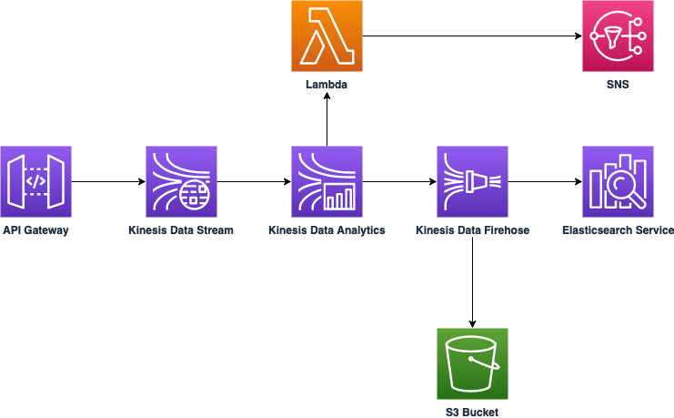

# Sierra Wireless Innovation Summit 2019 - Cloud Workshop

## Purpose
Build a solution that performs anomaly detection and data visualization of sensor's data in near realtime.
This solution also provide the ability to configure live alerting depending on the anomaly score.
The sensor data is also backed up in an Amazon S3 bucket for further use.

The anomaly detection relies on the Random Cut Forest algorithm https://docs.aws.amazon.com/kinesisanalytics/latest/sqlref/sqlrf-random-cut-forest.html

## Prerequisites
Here is an example of the payload data that it is expected from the application :
```json
{
    "Data": {
      "deviceId": "mangoh_device",
      "creationDate": 1571735678858,
      "generatedDate": 1571735677678,
      "accel": {
          "x": -0.688896,
          "y": -0.742716,
          "z": 9.868196
      },
      "light": 146,
      "temp": 32.457031,
      "location": "48.875004,2.235794"
    },
    "PartitionKey": 1  
}
```
Please make sure to configure the appropriate edge and cloud action in Octave to send data in the format described above to AWS. During the workshop, a high frequency (every 2 seconds) is recommended. (This will speed up the Random Cut Forest Algorithm learning phase)

### On Octave
#### 1. Create an Edge action :
An edge action to aggregate different observations in the same event is required.
Here's a code sample :
```javascript
function(event) {
    
    // Reads a value from the light sensor right away
    var light = Datahub.read("/light/value", 0);
    light = light ? light.value : null;

    // reading a new value from the accelerometer sensor
    var accel = Datahub.read("/imu/accel/value", 0);
    accel = accel ? accel.value : null;

    // reading value from the temperature sensor
    var temp = Datahub.read("/imu/temp/value", 0);
    temp = temp ? temp.value : null;

    return {
      // Sends immediately to the cloud, into stream "/company/devices/device/:default")
      "cl://" : [{
        light: light,
        accel: accel,
        temp: temp
      }],
  }
}
```

#### 2. Create a cloud action to send the events to AWS :
The cloud action will be responsible for relaying the data to AWS.
Here's a code sample :
```javascript
function(event) {
  var deviceId = event.path.split("/")[3];
  var location = event.location.lat.toString() + "," + event.location.lon.toString();
  var payload = {
    "Data": {
      "deviceId": deviceId.toString(),
      "light": event.elems.light,
      "accel": event.elems.accel,
      "temp": event.elems.temp,
      "location": location,
      "creationDate": event.creationDate,
      "generatedDate": event.generatedDate
    },
    "PartitionKey": 1
  };
  var putBody = JSON.stringify(payload);
  var putHeaders = {
    'Content-Type': 'application/json'
  };
  // update the url with your own service
  var result = Octave.Http.put('<replace_with_your_endpoint>/streams/sw-stream/record', putHeaders, putBody);
  var new_event = {
    "elems": result
  };

  return {
    "<replace_with_your_stream": [new_event],
  }
}
```


## Architecture




## Step by step guide
### ...During Sierra Wireless Innovation Summit
Some components of the architecture have been deployed ahead of the workshop (in order to save some time).
We will primarily focus on building The Kinesis Data Analytics and the Kinesis Data firehose components.
#### 1. Connect to your temporary AWS accounts
Go to https://dashboard.eventengine.run and enter the hash number you've been provided with and open the AWS Console.
Welcome to your temporary AWS account.
#### 2. Retrieve your Amazon API gateway endpoint
In the AWS console, navigate to CloudFormation. On the deployed stack output, copy the API Gateway endpoint, and make sure you are using this endpoint in your Octave cloud actions to send data to AWS.
#### 3. Prepare Elasticsearch and Kibana
Navigate to Elasticsearch service on the AWS Console and browse the Kibana endpoint.
Go to Dev tools and create a mapping template :

```json
PUT _template/template_mangoh
{
  "index_patterns": ["mango*"],
  "mappings": {
    "_source": {
      "enabled": true
    },
    "properties": {
      "location": {
        "type": "geo_point"
      }
    }
  }
}
```
Now navigate to Index management, click on saved objects and import the file elasticsearch/sw-kibana-objects.json. This will import the index pattern, visualizations and the dashboard.

#### 4. Configure Kinesis Data Analytics :
Navigate to Kinesis Data Analytics and create a new SQL application.
Connect it to the "**sw-stream**" Kinesis Data Stream and use this query :

```sql
CREATE OR REPLACE STREAM "TEMP_STREAM" (
    "device_id"      VARCHAR(32),
    "creation_date"  TIMESTAMP,
    "generated_date"  TIMESTAMP,
    "light_sensor"   INTEGER,
    "acc_x" DOUBLE,
    "acc_y" DOUBLE,
    "acc_z" DOUBLE,
    "temp_sensor" DOUBLE,
    "location" VARCHAR(128),
    "ANOMALY_SCORE"  DOUBLE,
    "ANOMALY_EXPLANATION" VARCHAR(20480));
 -- Creates an output stream and defines a schema
 CREATE OR REPLACE STREAM "DESTINATION_SQL_STREAM" (
    "device_id"      VARCHAR(32),
    "creation_date"  VARCHAR(20),
    "generated_date"  VARCHAR(20),
    "light_sensor"   INTEGER,
    "acc_x" DOUBLE,
    "acc_y" DOUBLE,
    "acc_z" DOUBLE,
    "temp_sensor" DOUBLE,
    "location" VARCHAR(128),
    "ANOMALY_SCORE"  DOUBLE,
    "ANOMALY_EXPLANATION" VARCHAR(20480));
    
 -- Creates an output stream for the alerting
 CREATE OR REPLACE STREAM "ANOMALY_SQL_STREAM" (
    "device_id"      VARCHAR(32),
    "creation_date"  VARCHAR(20),
    "generated_date"  VARCHAR(20),
    "ANOMALY_SCORE"  DOUBLE);
    
 -- Compute an anomaly score for each record in the source stream
 -- using Random Cut Forest
 CREATE OR REPLACE PUMP "STREAM_PUMP" AS INSERT INTO "TEMP_STREAM"
    SELECT STREAM
    "deviceId" as "device_id",
    "creationDate" as "creation_date",
    "generatedDate" as "generated_date",
    "light" as "light_sensor",
    "x" as "acc_x",
    "y" as "acc_y",
    "z" as "acc_z",
    "temp" as "temp_sensor",
    "location",
    "ANOMALY_SCORE",
    "ANOMALY_EXPLANATION" FROM TABLE(RANDOM_CUT_FOREST_WITH_EXPLANATION(CURSOR(
        SELECT STREAM 
        "deviceId",
        TO_TIMESTAMP("creationDate") as "creationDate",
        TO_TIMESTAMP("generatedDate") as "generatedDate",
        "light",
        "x",
        "y",
        "z",
        "temp",
        "location"
        FROM "SOURCE_SQL_STREAM_001"), 10, 256, 10000, 10, true));

-- Insert into output stream
 CREATE OR REPLACE PUMP "OUTPUT_PUMP" AS INSERT INTO "DESTINATION_SQL_STREAM"
    SELECT STREAM
    "device_id",
    TIMESTAMP_TO_CHAR('yyyy-MM-dd', "creation_date")||'T'||TIMESTAMP_TO_CHAR('HH:mm:ss', "creation_date"),
    TIMESTAMP_TO_CHAR('yyyy-MM-dd', "generated_date")||'T'||TIMESTAMP_TO_CHAR('HH:mm:ss', "generated_date"),
    "light_sensor",
    "acc_x",
    "acc_y",
    "acc_z",
    "temp_sensor",
    "location",
    "ANOMALY_SCORE", 
    "ANOMALY_EXPLANATION"
    FROM "TEMP_STREAM";

-- Insert detected anomalies into a separate output stream
 CREATE OR REPLACE PUMP "ALERT_PUMP" AS INSERT INTO "ANOMALY_SQL_STREAM"
    SELECT STREAM
    "device_id",
    TIMESTAMP_TO_CHAR('yyyy-MM-dd', "creation_date")||'T'||TIMESTAMP_TO_CHAR('HH:mm:ss', "creation_date"),
    TIMESTAMP_TO_CHAR('yyyy-MM-dd', "generated_date")||'T'||TIMESTAMP_TO_CHAR('HH:mm:ss', "generated_date"),
    "ANOMALY_SCORE"
    FROM "TEMP_STREAM"
    WHERE "ANOMALY_SCORE" > 5;

```

#### 5. Configure a Kinesis Data Firehose delivery stream :
The Kinesis Data Firehose delivery stream will send data to ElasticSearch in near real-time. It will also dump all the data in an S3 bucket.

#### 6. Send Kinesis Data Analytics output to targets :
**DESTINATION_SQL_STREAM** should be sent to a Kinesis Data Firehose delivery stream created in step 5.
**ALERTING_SQL_STREAM** should be sent to the "**sw-lambda-notification**" Lambda function (to fire alerts)

#### 7. Visualization :
Go to Kibana and display the dashboard.

### ...On your own
You'll need to deploy the stack described in "**stack/sw-stack.yml**". This CloudFormation template deploy all the components described in our architecture. All you need to provide is the S3 bucket ARN in which you would like to backup your data.
You can deploy the CloudFormation template either from the AWS Console, or using the AWS CLI :

#### 1. Configure your AWS CLI
Follow this guide https://docs.aws.amazon.com/cli/latest/userguide/cli-chap-configure.html in order to configure your AWS CLI with the correct settings (credentials, region).

#### 2. Deploy the CloudFormation Template :
Simply execute the following command :
```
git clone https://github.com/ndjadi/sw-summit-cloud-workshop
aws cloudformation create-stack --template-body file://sw-summit-cloud-workshop/stack/sw-stack.yml --stack-name sw-stack --capabilities CAPABILITY_AUTO_EXPAND CAPABILITY_NAMED_IAM
```
#### 3. Start the Kinesis Data Analytics application :
Navigate to Amazon Kinesis in the AWS Console and start the "**sw-kinesis-data-analytics**" application.
